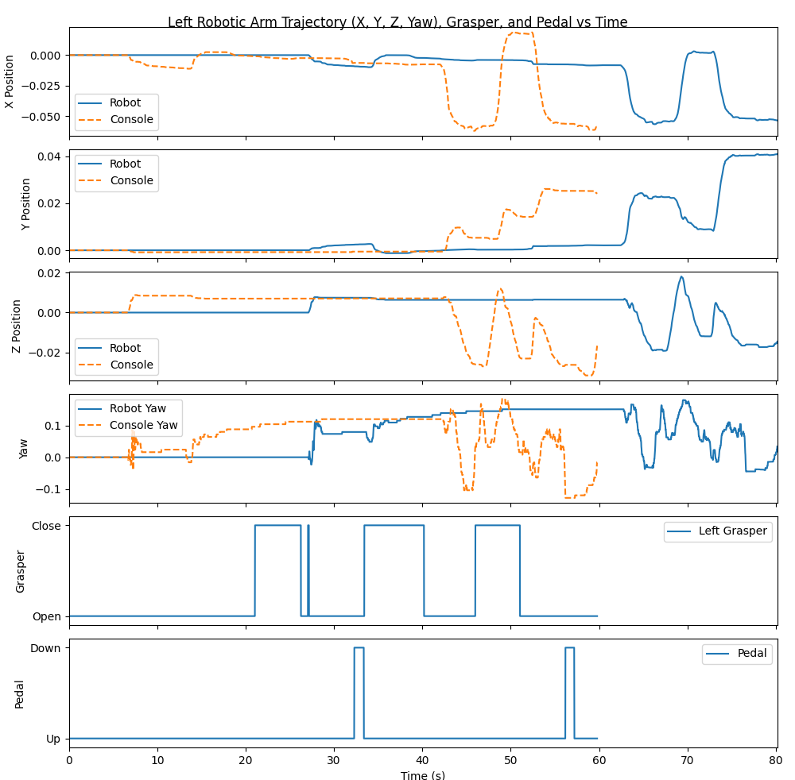
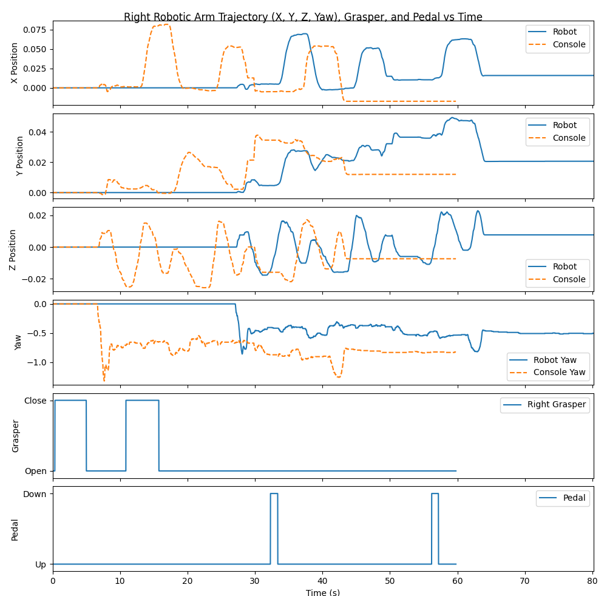
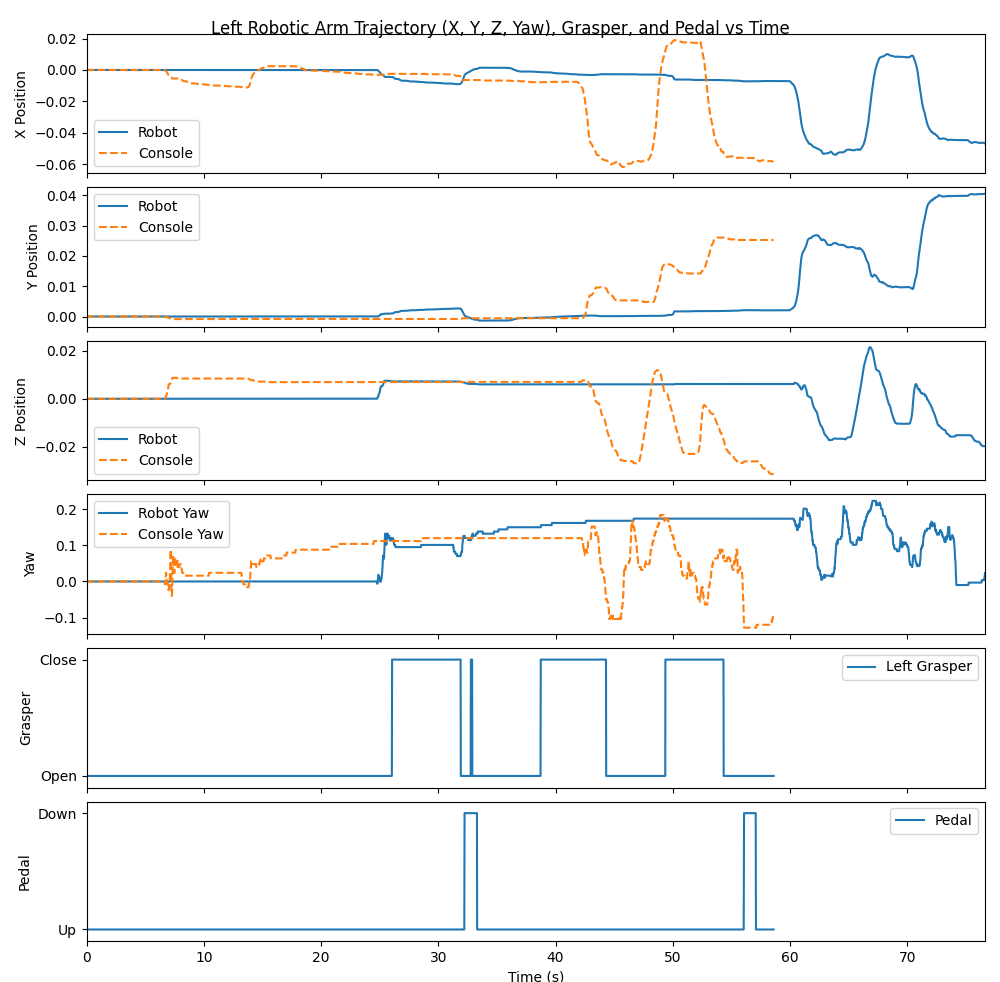
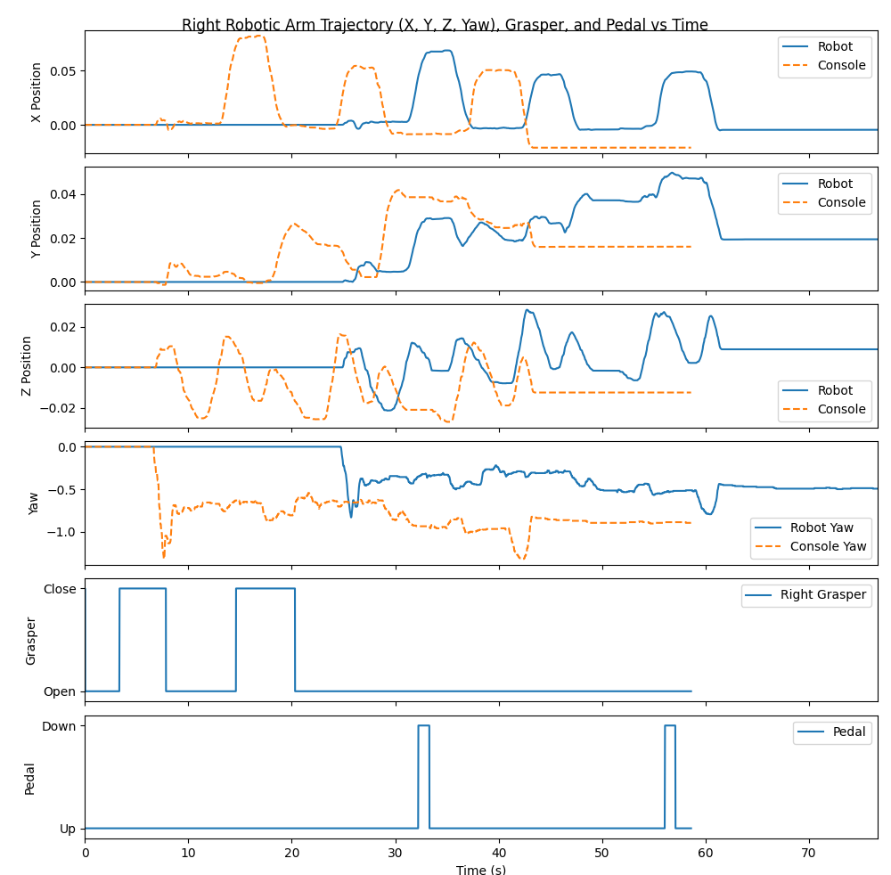
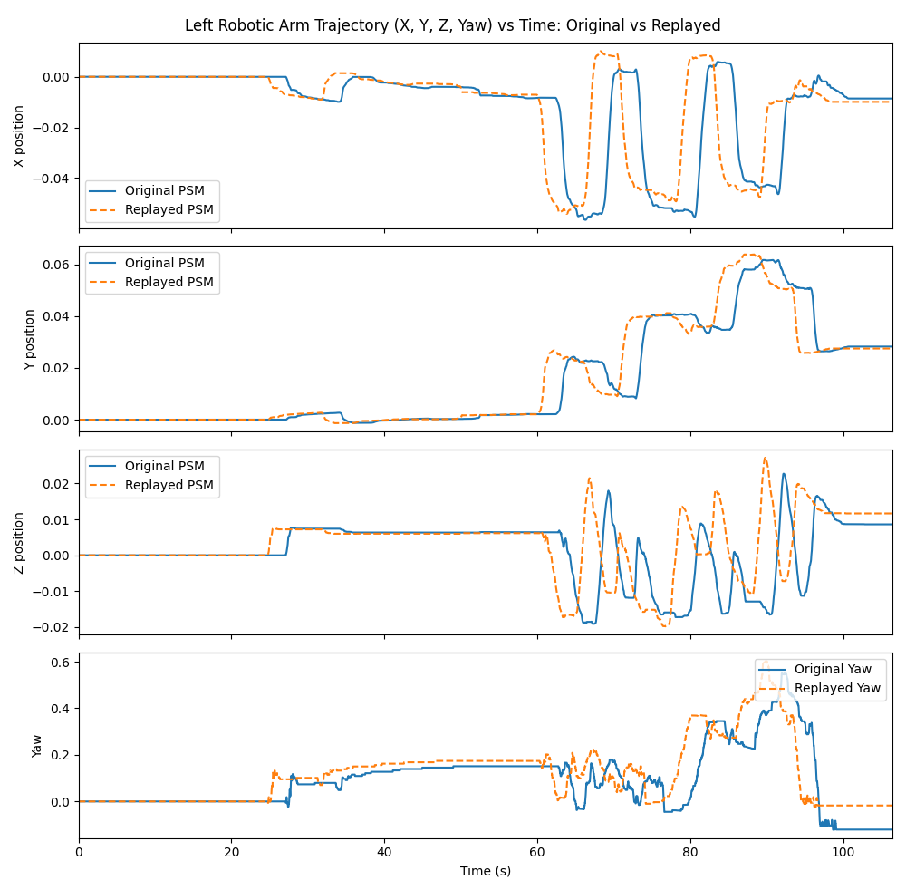
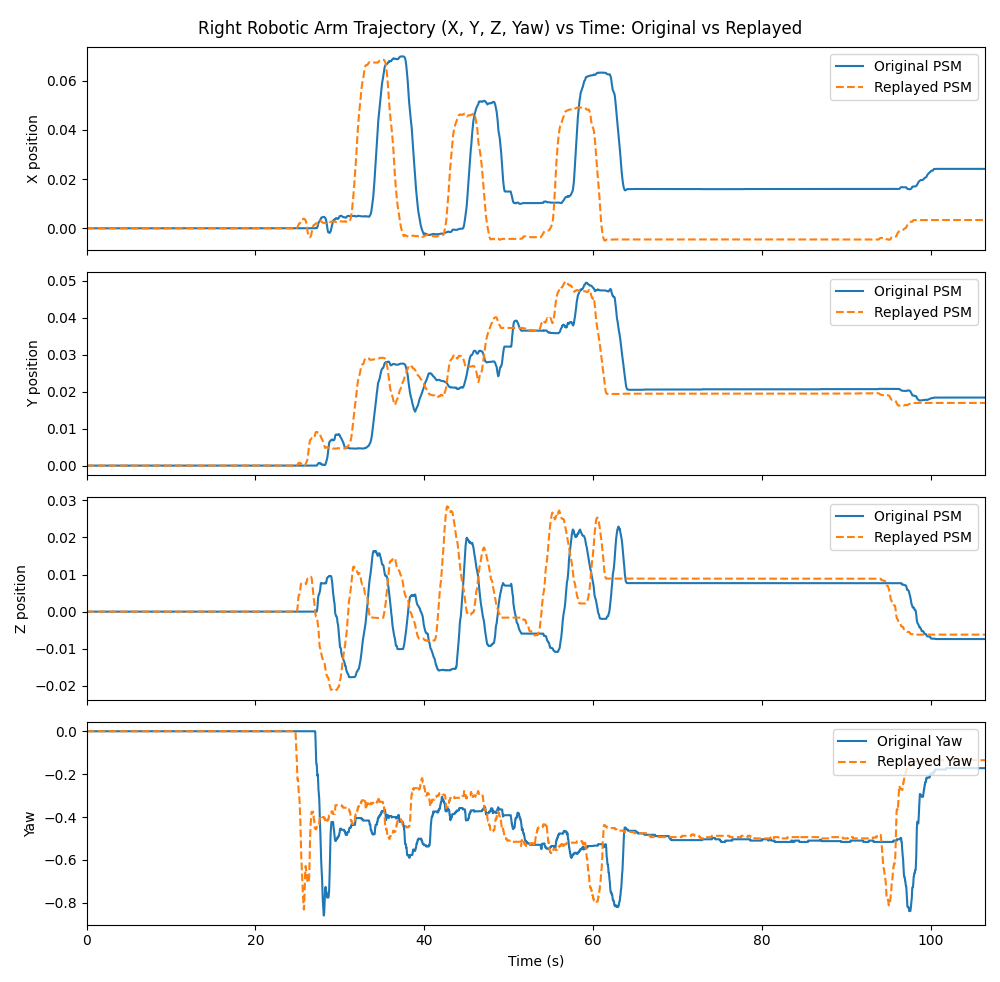

# Undergraduate Research Trial Task Submission
## 1. Summary
I successfully set up the simulator using a native Ubuntu 20.04 installation and was able to record the simulation. 

I then created a plotting script visualizing the difference between an original replay and another replay. I noticed that there is a difference between when the robot inputs occured indiciating some sort of timing mismatch.

Lastly, also modified the simulator to store RGB, depth, and segmentation data efficiently with no noticeable performance impact.

## 2. Environment and Setup
Currently running the simulator on Ubuntu 20.04 LTS with an Nvidia GPU and AMD CPU. 

## 3. Part 1: Simulator Setup
Initially had issues with X11 BadMatch errors while using a virtual machine or WSL so I eventually switched to booting to Linux. After installing Nvidia drivers (Proprietary nvidia-driver-570) the BadMatch errors were fixed. 

Recording of the simulation can be found at `figures/Report/simulation_recording.mkv` or through the following Google Drive Link: https://drive.google.com/file/d/15rIyGNkr8Ep3xQ90JTgvfhBz3wiwH6VA/view?usp=sharing

Although the simulation had consistent movements, I had varying results everytime the replay ran.
## 4. Part 2: Data Visualization and Trajectory Comparison

I have attached below the inital visualization of the original PSM kinematics of both the left arm and right arm
| Left Arm | Right Arm |
| :---: | :---: |
|   | 

I then replayed the simulation and plotted the PSM kinematics again which can be seen below

| Left Arm | Right Arm |
| :---: | :---: |
|   | 

Although they look similar, we can see the difference in time in the kinematics. In addition to that, there is a fairly significant shift between the Robot and the console output.

To better see the difference between the original run and the replayed trajectories, I created another script found in `analysis/network/plot_original_and_replay.py' to plot both the original and replayed trajectories and report error values between the two graphs

| Left Arm | Right Arm |
| :---: | :---: |
|   | 

### Left Arm Error Values
| Left X| Left Y | Left Z | Left Yaw |
| :---: | :---: | :---: | ---: |
| MAE: 0.004079  | MAE: 0.001655 | MAE: 0.003598 | MAE: 0.044164 |
| Max Error: 0.044101 | Max Error: 0.024820 | Max Error: 0.038269 | Max Error: 0.329238 |

### Right Arm Error Values
| Right X| Right Y | Right Z | Right Yaw |
| :--- | :---: | :---: | ---: |
| MAE: 0.015812  | MAE: 0.002710 | MAE: 0.005327 | MAE: 0.061396 |
| Max Error: 0.072686 | Max Error: 0.024145 | Max Error: 0.044219 | Max Error: 0.831262 |

As seen in the visualizations we can see that the replays have the exact same trajectories but at different times. 

This desyncrhonization is due to how packets are sent through the replay script. After further analysis of replay.py and specifically the variables `time_delta (line 44)` and `sleep_time (line 45)`, we can see that sleep_time varies wildly due to the script being relative to the previuos packet. After printing the values sleep_time was, I noticed that it can vary significantly with the sleep_time ranging from numbers like 1.38e-05 to 0.01 and also sometimes 0. This varying sleep_time leads to drift over time as the differences compound throughout the replay. 

This drift can be mitigated by changing how the packets are sent. Instead of relying on a relative sleep_time we can sync the replay to an absolute global clock, ensuring that packets are sent at consistent intervals.

## 5. Part 3: Simulation Development
I edited the `multiple_scenes_console_replay.py` file and modified it to store RGB, Depth, and Object segmentation data. The RGB, Depth, and Object segmentation outputs are stored in `SurRoL_dVTrainer/tests/dVTrainer/Data/exp_data_15/no_fault` where rgb, depth, and seg directories are created. These directories are cleared each time it is run to prevent output from multiple sessions overlapping. .png files are saved for rgb while depth and object sementation saves .png and .npy files. Outputs should be in the format `{idx}_{type}.png` ex `/depth/000000_depth.png`

To efficiently capture data, multithreading was utilized through `concurrent.futures` where I used the `concurrent.futures.ThreadPoolExecutor()` to prevent the disk writing from pausing the main simulation loop. In addition to that, the OpenCV method `cv2.imwrite()` was used as opposed to `imageio.imwrite()` due to the OpenCV method being faster.

To implement this a new FrameRecorder class was created where step is called each frame and saves the rgb, depth, and object sementation output every n frames. Additionally, performance statistics such as FPS, frame capture overhead, disk-writing overhead, and memory usage. To calculate memory usage, the library `psutil` was used. 

The PyBullet method `.getCameraImage()` was used to capture camera data. This method is appropriate for this task as it captures RGB, depth, and segmentation masks which is the data we are trying to capture.

### Example Outputs:
**rgb.png**

**depth.png**

**seg.png**

As we can see, unfortunately the captured images are black with rgb.png having some noise at the top. This could potentially be due to a conflict between PyBullet and Panda3D or a camera issue but I aim to do more research in the future to help resolve this issue.

## 6. Code Changes
Created script `plot_original_and_replay.py` to plot two different replays and visualize the difference in trajectories.

### `multiple_scenes_console_replay.py` 
- Added new imports, `concurrent.futures`, `psutil`, `cv2` (lines 16-18)
- Added varaibles for output directory and how many n frames for easy changing (Lines 56-60)
- Created FrameRecorder class and methods to capture RGB, depth, and object segmentation data. (lines 1729-1844)
- Initialized FrameRecorder in the SurgicalSimulatorBimanual class (lines 2344-2349)
- Called `frame_recorder.step` in `_step_simulation_task` (Lines 2364 and 2407)
- Closed frame_recorder in `on_destroy` method (Line 2589)
## 7. Usage Instructions
### Data Visualization
To run `/analysis/network/plot_original_and_replay.py`, ensure that the directories `SurRoL_dVTrainer/tests/dVTrainer/Data/exp_data_15/no_fault/freefault1` and `SurRoL_dVTrainer/tests/dVTrainer/Data/exp_data_15/no_fault/freefault2` exist to compare two replays. Then run `python plot_original_and_replay` to generate the visuals.

### Updated multiple_scenes_console_replay.py
First install psutil by doing `pip install psutil` and then run `python multiple_scenes_console_replay.py` Variables such as N and output directory can be found on lines 57 and 60 respectively

### Run Tests
To run `test_frame_recorder.py` first install PyTest by running `pip install pytest`. Run the file with `pytest test_frame_recorder.py`, this will launch to the simulator. After navigating to the Bi-Peg transfer and running the simulator, the test will conclude. 
## 8. Results
In part 2, I was able to create visuals comparing the original and replayed trajectories and error values between the two replays

In part 3, edited `multiple_scenes_console_replay.py` to store RGB frames, depth maps, and object segmentation masks efficiently.
## 9. Performance Profiling

n = 5
===== FrameRecorder Performance =====
  Sim frames total  : 5084
  Frames saved      : 1017
  Capture interval  : every 5 frame(s)
  Avg sim loop freq : 57.9 FPS
  getCameraImage    : mean=11.62ms  max=829.79ms
  Disk write (bg)   : mean=10.44ms  max=114.17ms
  Process RSS mem   : 784.5 MB

n = 1
===== FrameRecorder Performance =====
  Sim frames total  : 4930
  Frames saved      : 4930
  Capture interval  : every 1 frame(s)
  Avg sim loop freq : 56.4 FPS
  getCameraImage    : mean=11.59ms  max=840.05ms
  Disk write (bg)   : mean=9.97ms  max=164.59ms
  Process RSS mem   : 775.4 MB

As we can see above the FrameRecorder is able to efficiently save these frames with FPS being over 55 for both capturing for every n=1 frames and n=5 frames.

## 10. Tests
Ran any edited code several times to ensure consistent output and results. 

Created simple test using PyTest in the file `test_frame_recorder.py` to ensure directories are being created properly.
## 11. Limitations and Future Improvements
In part 2, I would like to work on fixing this time discrepency in the future. 

One main limitation is in part 3 with how the rgb, depth, and object segmentation images are saved. In the future, I would hope to fix this issue and look into what is casuign the problem more. 
## 12. GenAI Use Disclosure
Generative AI, specifically Google Gemini, was used to help setup the enivronment as I was initally running into several errors setting up the simulator. 

Claude was used for debugging. Claude was also used to help with portions of part 3 such as making depth and seg visible in the method `write_frame` and suggested creating copies in the method `step` both in the `FrameRecorder` class. 

Gemini was also utilized to create simple test found in `test_frame_recorder.py`

Outputs of all AI output was checked manually.